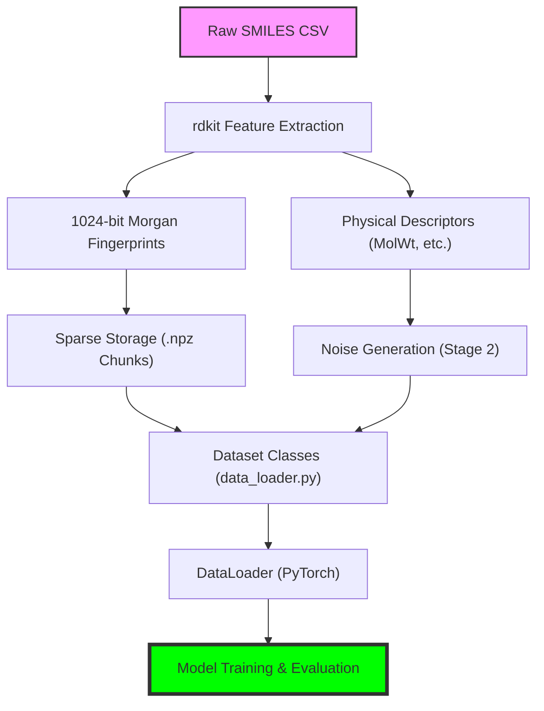

This document is designed as a study resource for understanding how raw chemical data is transformed into a robust, high-performance machine learning pipeline. It covers the **simulation of noise**, **efficient structural encoding**, and **scientific generalization** strategies.

---

## 🗺 Pipeline Workflow: High-Level View

Before diving into individual components, here is how data moves through the entire system:



---

## 1. The Architecture of Noise: The `NoiseMixer`

In predictive chemistry, baseline models (like Group Additivity) suffer from **systematic errors**. If a model fails to account for a specific ring strain, every molecule with that ring will be systematically wrong. We simulate this using the `NoiseMixer`.

### 🧪 Concept: Structural vs. Random Noise
- **The Goal: Real-World Realism**: In the real world, "ground truth" data is rarely pure. It often comes from experimental measurements or lower-level simulations that have consistent, structural flaws. The `NoiseMixer` simulates these real-world imperfections to ensure our models are robust.
- **Random Noise**: Purely stochastic, usually Gaussian $\mathcal{N}(0, \sigma)$. It represents measurement jitter.
- **Structural Bias**: Deterministic error based on the molecule's shape. We use a Neural Network to "learn" a fake set of physics that corrupts the data.

### 💻 Implementation Reference
- **Core Logic**: `generate_structural_dataset.py` 
  - *Topic location*: See `class NoiseMixer` (Lines 117-133) and the bias generation logic (Lines 142-153).
- **On-the-fly Dynamic Noise**: `data_loader.py`
  - *Topic location*: See `DynamicMoleculeDataset._get_items()` (Lines 104-108).

### 🛠 The Mechanism: How it Works
1. **Feature Extraction**: We use RDKit to extract a **1024-bit Morgan Fingerprint** (structural essence) and **3 physical descriptors** (Molecular Weight, Rotatable Bonds, Aromatic Rings).
2. **The "Fake Physics" MLP**: These features are concatenated and fed into a 3-layer Neural Network (`NoiseMixer`). Because the network is initialized with specific weights and never trained on real chemistry, it behaves as a deterministic, "wrong" physics engine.
3. **Descriptor Normalization**: To ensure the MLP doesn't get overwhelmed by large numbers (like MolWt), descriptors are normalized before processing.
4. **Bias Scaling**: The raw output of the MLP is scaled to a realistic magnitude (approx. 0.5 units of standard deviation) to ensure the noise is challenging but not destructive to the signal.

> [!TIP]
> **Core Intuition**: The `NoiseMixer` effectively creates "pockets of error" in chemical space. Because the MLP is a continuous function, similar molecules (with similar fingerprints and descriptors) will receive similar "wrong" values. This perfectly mirrors real-world **structural noise**, where a model might be consistently wrong about a specific functional group or structural motif.

### 🧠 Advanced Logic: Complexity-Weighted Variance
To make the data even more realistic, we scale the random noise component by the molecule's **physical complexity**. This ensures that complex molecules have a higher degree of uncertainty, mirroring real-world experimental difficulty.

1.  **Z-Score Standardization**: Descriptors (MolWt, Rotatable Bonds, Aromatic Rings) are standardized so different units are comparable.
2.  **Relative Averaging**: We calculate the mean of these standardized scores for each molecule.
3.  **MinMax Squashing**: That average is MinMax scaled into a **0 to 1 range**, representing the molecule's relative complexity within the dataset.
4.  **Dynamic Sigma**: We define the noise variance using: $\sigma_{\text{molecule}} = 0.5 + 1.0 \times \text{Complexity}$. 
    - This means the most complex molecules have **3x more random noise** ($\sigma=1.5$) than the simplest ones ($\sigma=0.5$).

**Final Formula:**
$$ \text{Noisy Value} = \text{Clean Value} + \underbrace{\text{Mixer}_{\theta}(\text{Structure})}_{\text{Structural Bias}} + \underbrace{\mathcal{N}(0, \sigma_{\text{complexity}})}_{\text{Complexity Noise}} $$

---

## 2. Fingerprints: Smart Encoding & Memory Optimization

Converting chemical SMILES strings into model-ready vectors is a bottleneck. We solve this using two "smart" strategies: **Sparse Storage** for disk and **Bit-Packing** for RAM.

### 💻 Implementation Reference
- **Generation Script**: `smiles_to_fp.py`
  - *Topic location*: See `generate_fingerprint()` (Lines 12-27) and the sparse saving logic using `sp.save_npz` (Lines 80-85).
- **Sparse Loading**: `data_loader.py`
  - *Topic location*: See fingerprint retrieval in `DynamicMoleculeDataset.__init__` (Lines 81-87).

### 🗄️ Disk Optimization: Sparse Storage & .npz
Before we even get to bit-packing, we use **Sparse Matrices** to save disk space. 
- **The Problem**: A 1024-bit fingerprint for one molecule has 1024 values. In a dense format, this is mostly zeros (chemically, only a few functional groups are present).
- **The Solution (CSR)**: We use the **Compressed Sparse Row (CSR)** format from `scipy.sparse`. It only stores the location and values of the "1s," ignoring the "0s."
- **Storage (.npz)**: The `sp.save_npz` function creates a compressed archive of these indices. This reduces a multi-gigabyte dataset into a few hundred megabytes on disk.

### 🔄 The Data Lifecycle: Disk to RAM
The transformation follows a three-stage lifecycle to balance speed and memory:

1. **Stage 1 (Disk)**: Stored as **Sparse `.npz` chunks**. Perfect for long-term storage and efficient reads.
2. **Stage 2 (Initialization)**: `data_loader.py` loads these chunks and uses `sp.vstack` to create a single **Feature Bank**.
3. **Stage 3 (RAM Optimization)**: 
   - In `SimpleScaffoldDataset`, the sparse bank is converted to a **Dense Array** and immediately **Bit-Packed** into `uint8` tensors for training.
   - In `CloudMoleculeDataset`, it may be stored as **Float16** to trade a bit more RAM for significantly faster GPU transfer speeds.

### 📐 The Morgan Fingerprint (ECFP4)
We use `rdkit` to generate 1024-bit Morgan Fingerprints with a radius of 2.
- **Radius 2**: Captures the local environment of an atom up to 2 bonds away (equivalent to ECFP4).
- **1024 Bits**: A fixed-length bit-vector mapping molecular sub-structures.

### 📦 Logic Check: Bit-Packing (RAM)
In `SimpleScaffoldDataset`, we pack the 1024-bit fingerprints into `uint8` tensors (128 bytes total). 
```python
# Location: src/model/data_loader.py (Line 294)
fp_subset = feature_bank[self.indices].toarray().astype(np.uint8)
packed_fp = np.packbits(fp_subset, axis=-1)
```

### 💎 Deep-Dive: The Bit-Packing Trick
Why do we bother with `np.packbits`?
- **Raw Memory**: Storing 1,000,000 molecules with 1024-bit fingerprints as `float32` requires **~4GB** of RAM.
- **Bit-Packed Memory**: By packing 8 bits into a single `uint8` byte, we reduce the memory footprint to **128 bytes per molecule**. Total RAM for 1M molecules drops to **~128MB**—an **8x reduction**.
- **CPU vs GPU Trade-off**: The fingerprints are stored "compressed" in RAM and only "unpacked" into full tensors during the training loop. This keeps the RAM footprint low enough to train massive datasets on consumer-grade hardware.

---

## 3. Generalization by Design: Scaffold Splitting

A major trap in molecular ML is "Memorization." If the Training and Test sets contain similar molecules, the model "cheats" by remembering similar shapes.

### 💻 Implementation Reference
- **Split Logic**: `generate_scaffold_splits.py`
  - *Topic location*: See `get_scaffold()` (Lines 38-45) and the 80/10/10 split logic (Lines 82-87).
- **Registry / Index Files**: Located in `data/groupadditivity_h298/indices/scaffold_split/`.

### 🏗 Bemis-Murcko Frameworks
1. **Extraction**: We strip all side chains, leaving only the "rings and bridges."
2. **Grouping**: Every molecule is assigned to its scaffold group.
3. **Partitioning**: We shuffle the **scaffolds** and divide them. This ensures Molecule A (Train) and Molecule B (Test) never share the same structural core.

---

All datasets are centralized in **`data_loader.py`**. Choosing the right dataset class depends on your hardware and experimental goals.

### 🍱 The Service Level Agreement (SLA)

| Dataset Class | Technology | Best For... | Technical Why? |
| :--- | :--- | :--- | :--- |
| **`DynamicMoleculeDataset`** | Sparse Loading | Prototyping | Loads precomputed blocks and merges them on-the-fly. Flexible but slower than others. |
| **`SimpleScaffoldDataset`** | **Bit-Packing** | High-Perf Training | Uses the `uint8` packing trick to keep millions of fingerprints in RAM concurrently. |
| **`CloudMoleculeDataset`** | Memory-Mapping | Kaggle/Cloud | Loads single `.pt` bundles. Uses `mmap=True` and `Float16` to avoid RAM flooding on shared nodes. |
| **`ARSDataset`** | On-the-fly Unpacking | DeepDelta Modeling | Automatically handles the conversion from `uint8` bits to `float32` tensors during the `__getitem__` call. |

### 🛠 How to Choose?
- **Working Locally with 2M+ Molecules?** Use `SimpleScaffoldDataset`. The bit-packing is the only way to avoid "Out of Memory" errors on 16GB-32GB machines.
- **Running on Kaggle?** Use `CloudMoleculeDataset`. It is optimized for the horizontal scaling and read speeds of cloud storage buckets.
- **Experimental Architectures?** Use `ARSDataset`. It abstracts away the bit-manipulation logic, allowing you to focus on the model layers.

### 🔗 Logic: Aligning the SMILES to the Value
The alignment ensures Molecule A always gets Fingerprint A:
1. Load the **CSV** (`data_loader.py`).
2. Use the **Registry** (`indices_path`) to subset the dataframe.
3. Use the **same indices** to slice the `.npz` feature bank (`data_loader.py`).

---

## 🚀 The Hybrid Lifecycle: Local $\rightarrow$ Cloud

Your project uses a specific "Hybrid" strategy to handle 8M+ molecules across different environments.

### 1. Local Generation (The Factory)
- **Tools**: `smiles_to_fp.py`, `generate_structural_dataset.py`.
- **Dataset**: `DynamicMoleculeDataset` or `SimpleScaffoldDataset`.
- **Why?** You have full control over your CPU cores and RDKit installation. You generate the "Structural Noise" and sparse fingerprints here.

### 2. The Bridge (Packaging)
- **Method**: `export_to_cloud_bundle()`.
- **Action**: This function "freezes" the processed data into a single `.pt` file, converting fingerprints to **Float16** to balance speed and compression.

### 3. Cloud Training (The Scale)
- **Tools**: Kaggle/Notebook Runners.
- **Dataset**: `CloudMoleculeDataset`.
- **Secret Weapon**: **`mmap=True`**. Memory-mapping allows Kaggle to train on a 16GB dataset without loading it all into RAM at once. It only "reads" the specific molecules required for the current training batch.
### 🧠 Technical Spotlight: Memory-Mapping (`mmap`)
Why is `mmap=True` the "secret weapon" for large datasets?

1. **Virtual Address Space**: Instead of the standard `read()` operation (which copies a file from disk into RAM), `mmap` tells the Operating System to map the file's secondary storage address directly into the program's virtual memory.
2. **Lazy "On-Demand" Loading**: When you ask for `dataset[500]`, the OS realizes that specific "page" of data isn't in RAM yet. It performs a **Page Fault**, fetches only that tiny slice of the 16GB file from disk, and puts it in the cache.
3. **RAM Preservation**: This allows a 16GB dataset to be used on a Kaggle node that only has 16GB of RAM. The OS automatically manages which parts of the file stay in RAM and which are cleared to make room for new batches.
4. **Zero-Copy Performance**: It eliminates the need to create a second copy of the data in the program's memory buffer, making it much faster to start training.

---

## 📝 Executive Summary: The "Big Picture"

To recap the entire lifecycle of a molecule in this pipeline:

1.  **Generation**: We take raw SMILES and generate **Morgan Fingerprints**. These are stored as **Sparse `.npz` chunks** to ensure we only save the "1" bits, drastically reducing disk usage.
2.  **Corruption (Realistic Noise)**: We simulate real-world scientific measurement error.
    -   **`NoiseMixer`**: Adds deterministic, structure-based bias.
    -   **Complexity Scaling**: Increases random noise for complex molecules (based on descriptors like MolWt).
    -   **Persistance**: This "noisy ground truth" is saved into a **CSV**.
3.  **Partitioning**: We use **Scaffold Splitting** to create index files (80% Train, 10% Val, 10% Test), ensuring the model cannot "cheat" by memorizing familiar shapes.
4.  **Local Alignment**: `SimpleScaffoldDataset` uses these indices to perfectly align the sparse fingerprints with the noisy CSV inputs.
5.  **Scaling for Training**:
    -   **Locally**: We use **Bit-Packing (`uint8`)** to fit millions of molecules in RAM.
    -   **Cloud/Kaggle**: We export the data to **Float16** bundles. This provides the best trade-off between fast GPU performance and memory-mapped RAM efficiency via the **`CloudMoleculeDataset`**.

